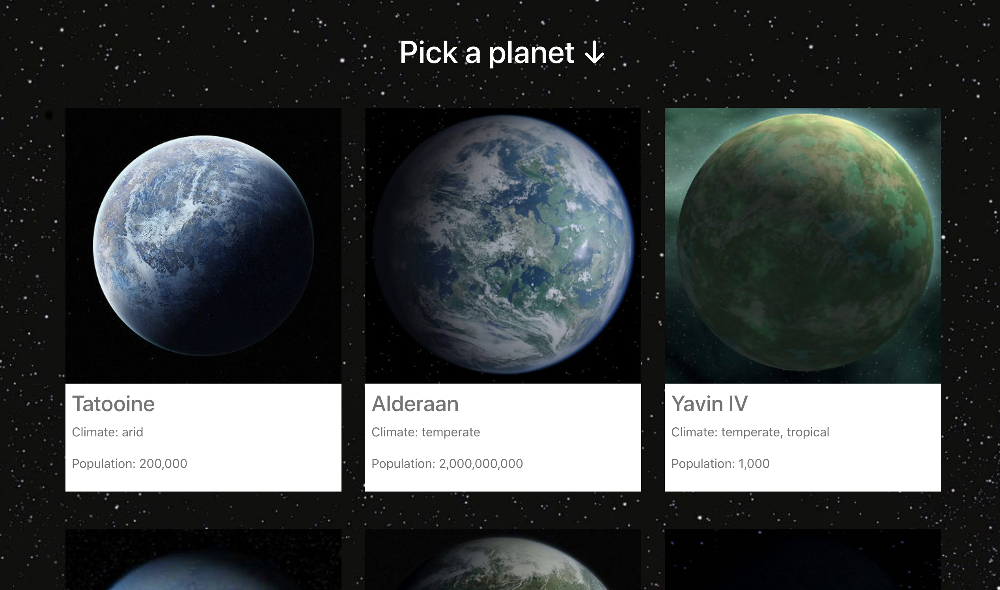
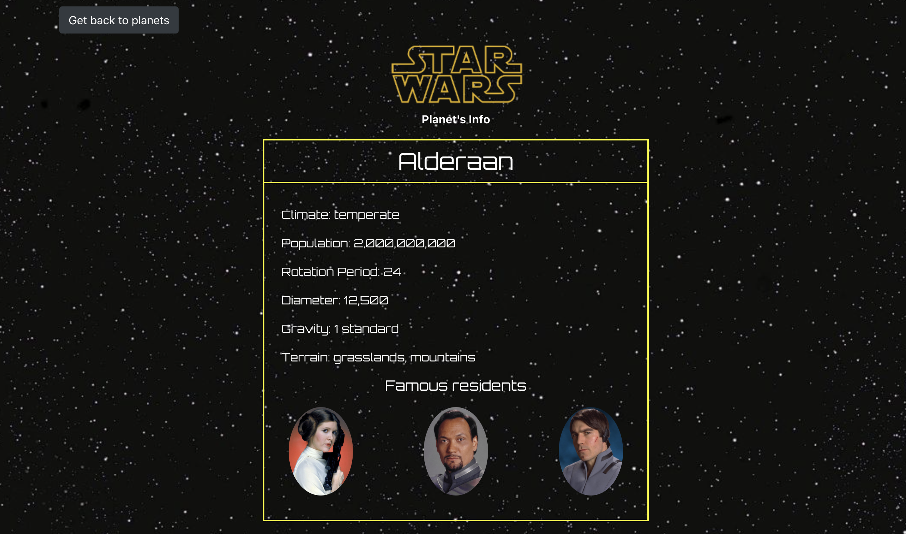

<h2> Genesis Starwars App</h2>




## I developed Starwas web app using Starwars.dev API based on React

## [Live Demo](https://genesis-starwars.web.app/)

## Technologies

- [React](https://reactjs.org/)
- [React-Hooks](https://reactjs.org/docs/hooks-intro.html)
- [React-Router](https://reactrouter.com/web/guides/quick-start)
- [Fetch](https://developer.mozilla.org/en-US/docs/Web/API/Fetch_API/Using_Fetch)
- [Bootstrap](https://getbootstrap.com/)
- [Material-UI](https://material-ui.com/ru/)
- [Numeral](http://numeraljs.com/)
- [Firebase](https://firebase.google.com/)

#### First, Install deps

```bash
$ npm install
#or
$ yarn install
```

#### In the project directory, run the development server::

```bash
$ npm start
#or
$ yarn start
```

Open [http://localhost:3000](http://localhost:3000) with your browser to see the result.
